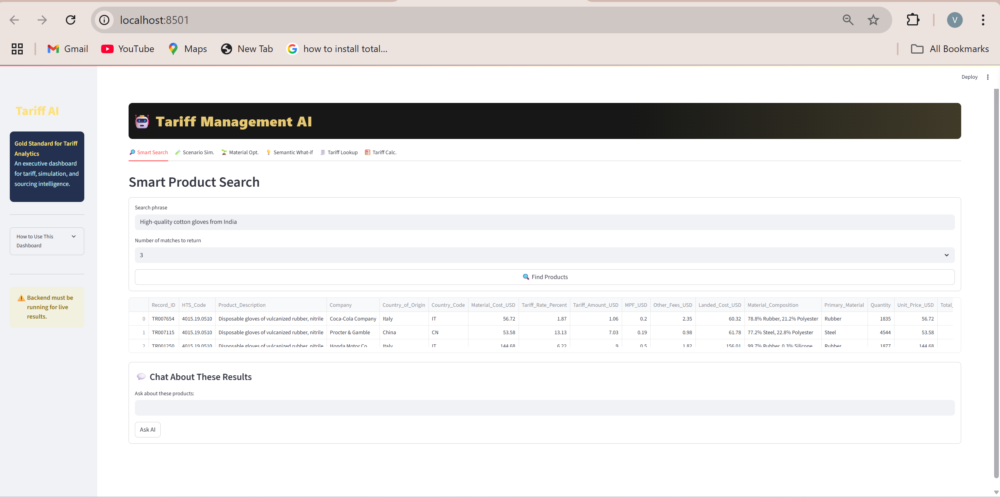

# 🧾 Tariff Management Chatbot

An intelligent, Streamlit-based AI assistant that helps users analyze, calculate, and simulate international tariff scenarios. The chatbot supports tariff lookup, HS code inference, cost-effective sourcing suggestions, and report generation — all within a conversational UI.

## 📌 Features

- 🔍 **Smart Product Search**: Find tariff details using natural language input.
- 📦 **HS/HTS Code Inference**: Automatically suggest product classification codes using AI.
- 💬 **Conversational Interface**: Interactive chatbot powered by OpenAI for seamless user experience.
- 🔁 **What-If Scenario Simulator**: Compare tariff impact based on country, sourcing options, or policy changes.
- 📄 **Auto-Generated Reports**: Export detailed tariff and sourcing summaries.
- 📊 **Tariff Cost Breakdown**: Visual display of import duties, shipping costs, and landed cost.
- 🧠 **OpenAI Integration**: Uses GPT-based models and embeddings for semantic understanding.
- 📁 **Custom Dataset Support**: Load and analyze tariff data from sources like WTO, USITC, or UN Comtrade.

---

## 📂 Project Structure
tariff_management_chatbot/
│
├── data/ # Datasets like tariffs, HS codes, etc.
├── scripts/ # Helper scripts (parsing, preprocessing, etc.)
├── src/ # Core logic (RAG chain, embedding store, etc.)
│
├── main.py #Backend logic 
├── streamlit.py # Streamlit UI logic
├── columns.py # Column display and formatting
├── setup.py # Setup configuration
├── requirements.txt # Python dependencies
├── .env # API keys and sensitive configs
└── .gitignore # Files ignored by Git

## Tech Stack

- **Frontend**: [Streamlit](https://streamlit.io/)
- **Backend**: Python + FastAPI (optional)
- **AI Models**: OpenAPI key
- **Embeddings**: OpenAI Embeddings
- **Vector Search**: FAISS / custom similarity search

---

##  Setup Instructions

1. **Clone the Repository**
   ```bash
   git clone https://github.com/videesh890/Tariff_chatbot.git
   cd Tariff_chatbot

2. **Create a Virtual Environment**
python -m venv venv   
.\venv\Scripts\activate  

3. **Install Requirements**
pip install -r requirements.txt

4. **Add .env File**

OPENAI_API_KEY=your_openai_api_key_here

5. **Run the main file for backend**
 main.py

6. **Run the Streamlit file**
 
 streamlit run streamlit.py 

## 🖼️ Sample Output




